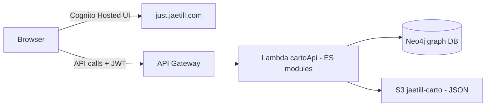

# Architecture

Carto is a Cognito-authed pen-test engagement manager. Frontend → API Gateway → Lambda → Neo4j + S3.

## Components

## Build modes

- **cloud** (default): Cognito + API Gateway backend
- **standalone**: localStorage only, single bundled HTML at `dist-local/index.local.html`

Backend adapter swap via `@carto/api` alias → `adapters/cloud.js` or `adapters/local.js`.

## Lambda particulars

`cartoApi` uses **ES modules** — `.mjs` files. `require()` will not work in lambda/. Imports use `import` syntax.

## Data flow

1. Engagement created via `POST /engagement` → Lambda creates Neo4j graph + initial S3 manifest
2. Tool output uploaded → Lambda parses (Nmap/Metasploit/Nessus/SharpHound/Nuclei/Ghostwriter) and ingests into Neo4j
3. Cytoscape renders the graph in-browser via API queries